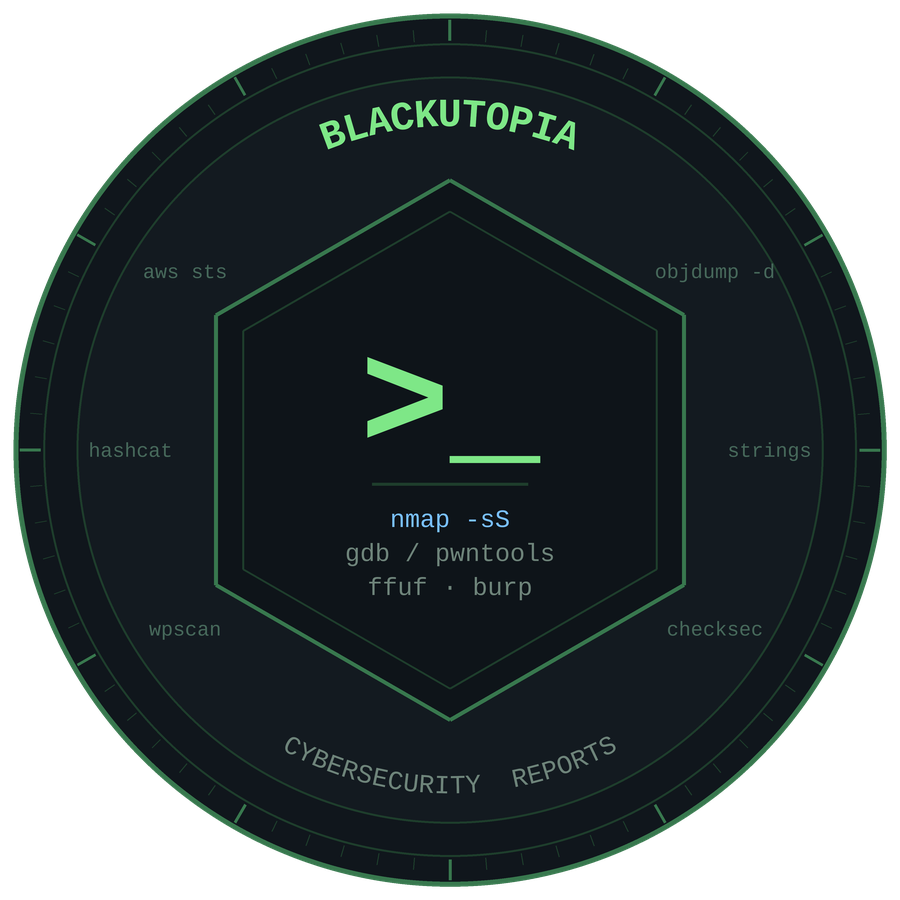

  

# Informes de Ciberseguridad

[English](README.md) · **Español** · [Italiano](README.it.md)

Una colección de informes técnicos sobre laboratorios, máquinas y retos CTF que he resuelto.

Cada informe es un documento PDF independiente que recoge el objetivo, el entorno, las fases del
ataque con sus evidencias, y unas conclusiones técnicas y defensivas finales. El estilo es
deliberadamente narrativo y no una simple lista de comandos: el objetivo es explicar **por qué**
funciona una técnica, no solo demostrar que funciona.

---

## Informes disponibles

| Informe | Contexto | Categoría | Técnicas principales | Leer |
|---|---|---|---|---|
| The Emptiness Machine | HTB Cyber Apocalypse 2026 | Binary Exploitation | FSOP, House of Apple 2, sobrescritura parcial, fuga de libc | [EN](English/The-Emptiness-Machine-HTB-2026-EN.pdf) · [ES](Espa%C3%B1ol/The-Emptiness-Machine-HTB-2026-ES.pdf) · [IT](Italiano/The-Emptiness-Machine-HTB-2026-IT.pdf) |
| False Ferry | HTB Cyber Apocalypse 2026 | Cloud Security | Enumeración IAM en AWS, STS AssumeRole, versionado de objetos S3 | [EN](English/False-Ferry-HTB-2026-EN.pdf) · [ES](Espa%C3%B1ol/False-Ferry-HTB-2026-ES.pdf) · [IT](Italiano/False-Ferry-HTB-2026-IT.pdf) |
| Fireflow | HTB (Media, Linux) | Web / RCE / Kubernetes | Enumeración de subdominios, RCE no autenticado (CVE-2026-33017, Langflow), reutilización de credenciales, falsificación JWT alg=none, exec del kubelet vía nodes/proxy | [EN](English/Fireflow-HTB-2026-EN.pdf) · [ES](Espa%C3%B1ol/Fireflow-HTB-2026-ES.pdf) · [IT](Italiano/Fireflow-HTB-2026-IT.pdf) |

---

## Competencias cubiertas

**Explotación de binarios**: análisis estático con objdump y nm, reversing de funciones, explotación
de estructuras internas de glibc, evasión de mitigaciones (Full RELRO, PIE, NX), depuración con GDB
mediante breakpoints y watchpoints por hardware, automatización de exploits en Python con pwntools.

**Seguridad en la nube**: enumeración de AWS con la CLI, análisis de permisos IAM, asunción de roles
mediante STS, recuperación de versiones anteriores de objetos en buckets S3.

**Explotación web y seguridad de aplicaciones**: enumeración de subdominios y de API, identificación y
explotación de CVE públicos (ejecución remota de código no autenticada), análisis de rutas de código
vulnerables desde el fuente, seguridad JWT (confusión de algoritmos y el fallo alg=none), falsificación
de tokens de autenticación.

**Seguridad de contenedores y Kubernetes**: enumeración de un pod comprometido, revisión de permisos de
la service account, abuso del permiso nodes/proxy para alcanzar el kubelet, ejecución de comandos en un
pod privilegiado que monta el sistema de ficheros del host para escapar de contenedor a host.

---

## Contacto

Giampiero Saponaro, especialista junior en ciberseguridad

- LinkedIn: [linkedin.com/in/giampiero-saponaro-cybersecurity](https://www.linkedin.com/in/giampiero-saponaro-cybersecurity)
- Portfolio: [giampierosap.github.io/GiampieroSaponaro](https://giampierosap.github.io/GiampieroSaponaro)

---

*Todos los informes se refieren exclusivamente a entornos de laboratorio autorizados y a retos CTF ya finalizados.*
